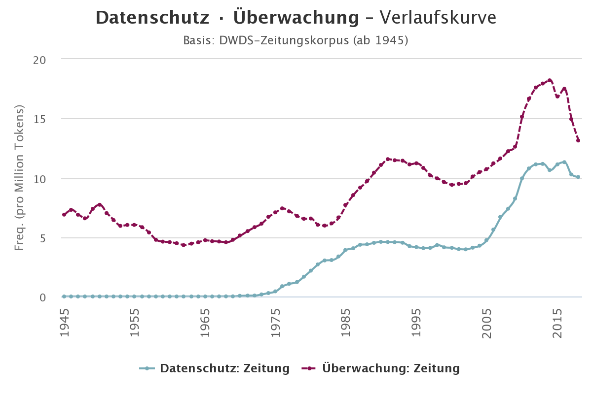

# Seminararbeit Gebrauchssemantik

**Titel**: Datenschutz und Überwachungskapitalismus - eine diachrone Analyse von semantischen Raumveränderungen

**Seminar**: 20FS 360-105a Gebrauchssemantik: Korpuslinguistische Methoden zur Analyse von Bedeutung

Dieses Repository enthält die in der Seminararbeit verwendeten Quellcodes.

## Forschungsfrage / Thema der Arbeit



Nach der Enthüllungen von Massenüberwachungsprogramm der National Security Agency (NSA) und Facebook-Datenskandal steht 
die Datenschutz nicht nur von der Regierung sondern auch von der Tech-Giganten viel mehr in Diskussion. 
Viele beginnen sich Sorgen um ihre Privatsphäre zu machen, die durch die rasante Entwicklung von Technologien
wie Gesichtserkennung oder Datenerfassung von Smartphones oder Online-Diensten stark beeinträchtigt wird. 
Dieses Diagramm von DWDS-Wortverlaufskurve zeigt sich, dass es eine starke Frequenzkorrelation zwischen
die Wörter „Datenschutz“ und „Überwachung“ im Zeitraum von 1995 bis 2015 gibt. In dieser Seminararbeit handelt es davon, 
wie sich die **semantische Räume** von einige bestimmte Ausdrücke über Technologie und Datenschutz im Lauf der Zeit verändern,
mit dem Hilfe der Erstellung und Forschung von **Word2Vec** word embeddings Modellen, die durch Korpora vom Projekt Deutscher 
Wortschatz jedes Jahr von 1995 bis 2015 trainiert. 


## Korpus: Projekts Deutscher Wortschatz / Leipzig Corpora Collection

Das Projekt Deutscher Wortschatz stellt Korpora in verschiedenen Sprachen und Größen zur Verfügung unter Verwendung 
gleicher Formate und vergleichbarer Quellen. Alle Daten liegen als Plaintext vor und können auch, mithilfe des 
beilegten Importskriptes, in eine MySQL-Datenbank importiert werden. Sie sind sowohl für die wissenschaftliche 
Verwendung durch Korpuslinguisten als auch als Eingabematerial für Verfahren der Wissensextraktion geeignet.

Die [Korpora](https://wortschatz.uni-leipzig.de/de/download) enthalten zufällig ausgewählte Sätze der jeweiligen 
Korpussprache und sind in Größen von 10.000 bis 
1.000.000 Sätzen verfügbar. Als Quelle werden typischerweise entweder Nachrichtentexte oder das Ergebniss allgemeinen 
Webcrawlings verwendet. Die verwendeten Texte sind immer in einzelne Sätze zerlegt und diese zufällig sortiert, 
so dass eine Wiederherstellung des Ursprungstextes nicht möglich ist. Ungrammatische Sätze und fremdsprachliches 
Material wurden bestmöglich entfernt. Weil Informationen zu Wortkookkurrenzen für viele Anwendungen hilfreich sind, 
wurden diese Angaben vorberechnet und sind ebenfalls enthalten. Für jedes Wort werden dabei die signifikantesten 
Nachbarschafts- (links & rechts) als auch Satzkookkurrenzen aufgeführt. Für mehr Details zur Erstellungsweise der 
Korpora siehe die unten aufgeführte [Veröffentlichung](http://www.lrec-conf.org/proceedings/lrec2012/pdf/327_Paper.pdf). 

>D. Goldhahn, T. Eckart & U. Quasthoff: Building Large Monolingual Dictionaries at the Leipzig Corpora Collection: 
From 100 to 200 Languages.
In: _Proceedings of the 8th International Language Resources and Evaluation (LREC'12)_, 2012

Genre: News (1995 - 2015)

Das Quellenmaterial stammt von Nachrichtenseiten (meist über RSS-Feeds).

| Jahr | Anzahl der Sätze | Anzahl der Wörter |
| ---: | ---: | ---: |
| 1995 | 1000000 | 16522150 |
| 1996 | 1000000 | 17280756 |
| ... | ... | ... |
| 2013 | 1000000 | 16624319 |
| 2014 | 969470 | 16799070 |
| 2015 | 962330 | 15660833 |

## Forschungsverfahren

1. Das word2vec-Modell eines jeden Jahres trainieren (2/20)
2. Repräsentative Wörter wählen und ihre semantische Räumen vergleichen
3. Plot von Ergebnisse erstellen / visualisieren
4. Ergebnisse recherchieren und interpretieren

Modelle erstellt von Korpus 1995:
```
>>> import gensim.models
>>> model = gensim.models.Word2Vec.load('models/1995-model')
>>> word_vectors = model.wv
>>> result = word_vectors.most_similar(positive=['frau', 'könig'], negative=['mann'])
>>> for _ in result:
...     print("{}: {:.4f}".format(*_))
... 
königin: 0.7436
prinz: 0.6736
prinzessin: 0.6658
gattin: 0.6654
maria: 0.6571
marie: 0.6406
sarah: 0.6368
anna: 0.6364
elizabeth: 0.6354
moritz: 0.6340
>>> result = word_vectors.most_similar('datenschutz')
>>> for _ in result:
...     print("{}: {:.4f}".format(*_))
... 
ombudsmann: 0.7700
polizeieinsatz: 0.7329
sachbearbeiter: 0.7060
abdruck: 0.7052
eckpunkten: 0.7045
richterspruch: 0.6956
klimaschutz: 0.6828
sachverhalt: 0.6810
messestandort: 0.6721
kahlschlag: 0.6675
```

Modelle erstellt von Korpus 2015:
```
>>> model = gensim.models.Word2Vec.load('models/2015-model')
>>> word_vectors = model.wv
>>> result = word_vectors.most_similar(positive=['frau', 'könig'], negative=['mann'])
>>> for _ in result:
...     print("{}: {:.4f}".format(*_))
... 
königin: 0.7361
gattin: 0.7131
prinz: 0.7122
witwe: 0.7048
kollegin: 0.6964
ehefrau: 0.6956
marie: 0.6937
jacques: 0.6924
regisseurin: 0.6901
susanne: 0.6858
>>> result = word_vectors.most_similar('datenschutz')
>>> for _ in result:
...     print("{}: {:.4f}".format(*_))
... 
richtlinien: 0.6648
klimaschutz: 0.6427
netzneutralität: 0.6269
austausch: 0.6212
schutz: 0.6181
infrastrukturen: 0.6104
rechtliche: 0.6084
suchmaschinen: 0.6081
webseiten: 0.6060
regeln: 0.6016
```
Siehe Auch: Visualisierung von Tensor board

## Probleme
1. sinnvolle/repräsentative Wörter wählen


## Literatur / Links

[Homo Deus – Eine Geschichte von Morgen](https://www.amazon.de/Homo-Deus-Eine-Geschichte-Morgen/dp/3406704018)

[Das Zeitalter des Überwachungskapitalismus](https://www.amazon.de/Das-Zeitalter-%C3%9Cberwachungskapitalismus-Shoshana-Zuboff/dp/359350930X/ref=sr_1_1?adgrpid=66677788796&dchild=1&gclid=CjwKCAjwtqj2BRBYEiwAqfzur_CE5mW1ykkuyKnpXtibrdaAr1UXqZZefTMoCzBziWDqTan-cIWtrBoCy4kQAvD_BwE&hvadid=380928051798&hvdev=c&hvlocphy=1003248&hvnetw=g&hvqmt=b&hvrand=14619687782605736049&hvtargid=kwd-600813601594&hydadcr=14744_1980669&keywords=der+%C3%BCberwachungskapitalismus&qid=1590343817&sr=8-1)

https://netzpolitik.org/2019/im-zeitalter-des-ueberwachungskapitalismus/

DWDS-Wortverlaufskurve für „Datenschutz · Überwachung“, erstellt durch das Digitale Wörterbuch der deutschen Sprache, 
<https://www.dwds.de/r/plot?view=1&corpus=zeitungen&norm=date%2Bclass&smooth=spline&genres=0&grand=1&slice=1&prune=0&window=3&wbase=0&logavg=0&logscale=0&xrange=1945%3A2018&q1=Datenschutz&q2=%C3%9Cberwachung>, 
abgerufen am 5/24/2020.
